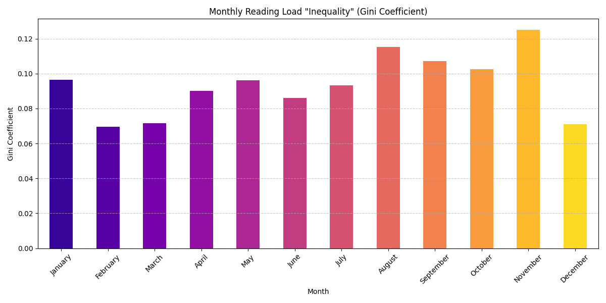

# Analysis of the Robert Murray McCheyne Bible Reading Plan

## Explanation
This project performs a statistical analysis of the Robert Murray McCheyne (RMM) Reading Plan to explore why some days and periods can feel so much more challenging than others. The analysis is based on a verse-by-verse word count of the entire plan, using the King James Version (KJV) of the Bible.

## Key Insights

* **Average Reading:** The average daily reading load is approximately 2,781 words.
* **Significant Variation:** Daily readings are not evenly distributed. The easiest day has only 1,616 words, while the most challenging day has 4,640 words.
* **Most Challenging Period:** The analysis identified a custom "Reading Challenge Score" that combines reading volume and volatility. This score peaks in mid-November, with the top three most challenging weeks being weeks 4, 28, and 46.
* **Monthly Inequality:** Some months have much more variation in daily reading loads than others. An analysis using the Gini coefficient shows that months like January and July have very unequal reading distributions, while April is much more consistent.

## Summary Statistics for Daily Word Counts

| Stat | Result |
| :--- | :--- |
| count | 365.000000 |
| mean | 2781.498630 |
| std | 551.987725 |
| min | 1616.000000 |
| 25% | 2366.000000 |
| 50% | 2743.000000 |
| 75% | 3146.000000 |
| max | 4640.000000 |

### Distribution of Daily Word Counts
This histogram shows the frequency of different daily word counts across the year.

### Monthly Word Count Distribution
This boxplot shows the range and median of daily word counts for each month.

### Normality Test (D'Agostino's K^2)
-   **P-value:** 0.0024
-   The p-value is less than 0.05, so we reject the null hypothesis.
-   **Conclusion:** The data is **not** normally distributed, confirming the day-to-day inconsistency.

### Outlier Detection (Days with Unusually High Word Counts)
These are days with reading counts outside the typical range of 1,196 to 4,316 words.

| Day | WordCount |
| :-- | :--- |
| 726 | 4640 |
| 123 | 4555 |
| 1005| 4376 |

## Advanced Analysis

### The "Reading Challenge Score"
To identify the most difficult periods of the year, a "Reading Challenge Score" was created. This score is designed to capture periods that are difficult due to both high volume and high day-to-day volatility.

The score is calculated over a 14-day rolling window and is based on two factors:
1.  **Volume:** The average daily word count for the period.
2.  **Volatility:** The standard deviation of the word count for the period.

A high score indicates a period where the reading is both consistently long and unpredictable.

**Most Challenging Periods:**
-   **Peak Challenge Day:** The single most challenging point in the year occurs around **November 14**.
-   **Top 3 Most Challenging Weeks (by average score):**
    1.  Week 46 (Mid-November)
    2.  Week 4 (Late January)
    3.  Week 28 (Mid-July)

### Monthly Reading "Inequality" (Gini Coefficient)
The Gini coefficient is a measure of statistical dispersion, often used to measure income inequality. In this context, it is used to measure how evenly the reading load is distributed throughout a month.

-   **Interpretation:** A Gini score of 0 represents perfect equality (every day has the same word count). A score closer to 1 represents high inequality (a few very long days combined with many short days).
-   **Finding:** Months like January and July show a high Gini coefficient, meaning the daily reading load is very uneven. April, by contrast, is one of the most consistent months.

